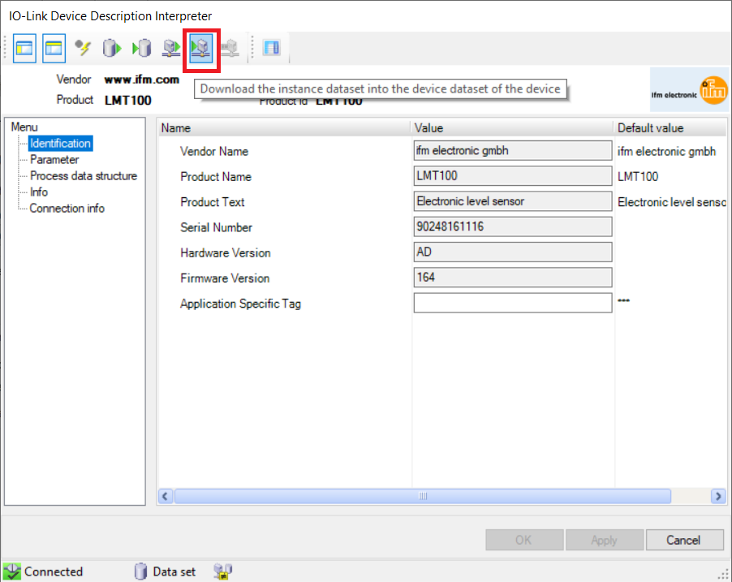
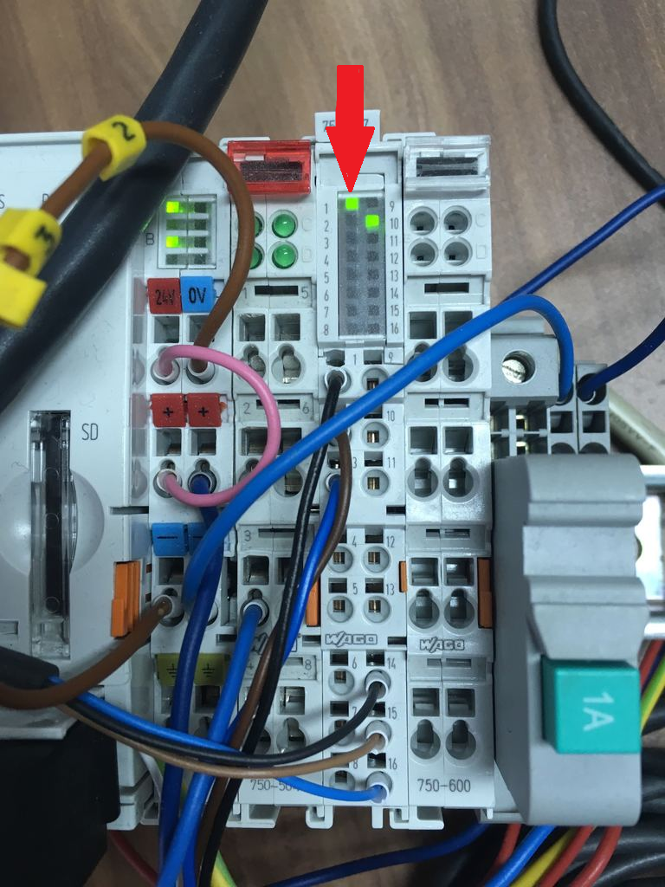

# Setup using sensor for point level detection IFM **LMT100**

## Obtaining IODD file

Download [from the IFM site](https://www.ifm.com/download/read_io-link_RU) the IODD file (IO Device Description). It will be an archive (*.zip), containing descriptions of a whole group of devices. Next we need to copy the sensor description file **LMT100** (*LMT\IODD1.1\ifm-000130-20150908-IODD1.1.xml*, the file name pattern is the following - **ifm-Device_ID-date-IODD_version.xml**) to the next directory:

>**c:\Users\Public\Documents\WAGO Software\IO-Link DDs\\**

## Connecting to the module

Launch WAGO-I/O-Check and connect to the (P)FC:

Select the interested module and go to the settings:

The setup wizard starts, it looks like this:

To connect to the module - button **Connect**:

The program will connect to the module, read its settings and display them. Four devices can be connected to the module (four ports for connection).

## Module setup

Check the general settings (should be as shown below):

For each port set the size of the device data. For sensors, the size of the reading area is 2 bytes, the writing area is not used - its size is 0 bytes. Therefore, for the first port the offset is 6 bytes, the read size is 2 bytes, and the write size is 0 bytes:

For other ports, the setup is similar - the previous port is taken into account. To save the settings, click the button **Write**:

## Port setup

Go to the configuration of port 1 (the connection should not be active - the **Connect** button should not be pressed). In the drop-down list **Operation Mode**, select **IO-Link**, in the drop-down list **IODD**, select **ifm-000130-20150908-IODD1.1.xml**:

Next we connect to the module (**Connect** button), click the **Write** button to write parameters.

## Sensor (device) setup

Click the **ShowDevice** button to display the device properties:

The window with the device properties is displayed, click the button **Upload ...** to read the values:

Значения считаются и отобразятся в соответствующих вкладках. Устанавливаем требуемые значения и нажимаем кнопку **Download ...** для записывания значений:

Values are read and displayed in the corresponding tabs. Set the required values and click the button **Download ...** to write the values:

## Storing settings made

To save the settings, click on the button **Save As User Settings**.

## The final check

The port (device) setup is completed, close all windows and the application. A properly configured and working port is displayed with a green light on the module:

